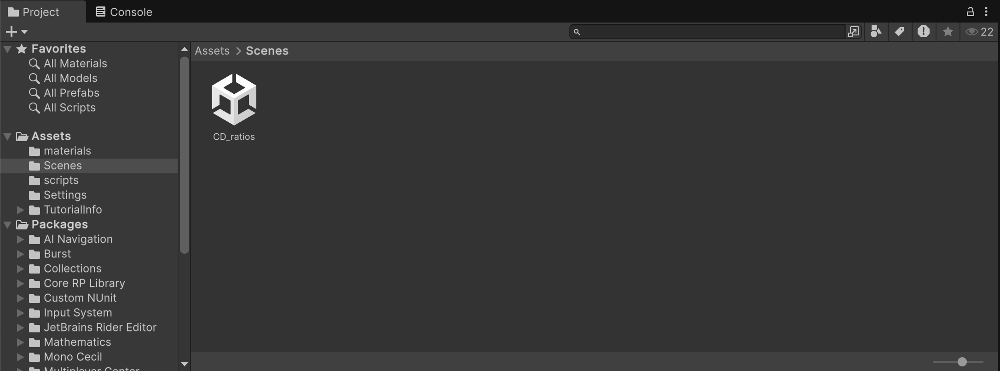

# Lab Session 6: Introduction to Unity & Pseudo-Haptics

The practical sessions for weeks 6 to 9 will build on a number of topics covered 
in the lectures, including vision, audio, haptics, memory, attention, 
experimental design, and data analyses as applied to interface evaluation. We 
explore these in a virtual reality interface, but the topics and concepts 
covered will be applicable to the evaluation of other interfaces.

## Requirements

**Bring your laptop.** This week's activities will not work on
an iPad or other touch-based device. You are also strongly encouraged to bring
a physical mouse if you can — it is possible to perform the experiments with a 
laptop trackpad, but the pseudo-haptic effect is notably weaker.

There is no audio component this week so you will not need headphones.

## Preparation

These practical sessions make use of the [Unity](https://unity.com/) game engine. Unity is a very widely used engine that allows both graphical and scripted development. For the purposes of the labs, you will not be required to write any code — we will provide a working application and you will adjust the parameters of this through Unity’s GUI.

**You will need to [install Unity](https://unity.com/download) on your computer
in order to complete the labs. Please do this <u>before</u> this week's lab 
session.**

As part of the setup process you will need to create an account. Do not be 
intimidated by Unity's licensing structure — the free personal version is all 
you need. (But if you already have some other license that should be fine too.)

The code packages used in these labs have been produced with the latest LTS version of the Unity editor at the time of writing, which is 6000.3.8f1, but should work on other versions that support the Universal Rendering Pipeline.

Basic guidance on getting familiar with the Unity environment can be found at 
[learn.unity.com](https://learn.unity.com). However, we will cover the steps 
required in the lab sessions.

You are not required to do any scripting yourself in the sessions, but if you 
would like to give it a try have a look at [this introductory 
tutorial](https://learn.unity.com/project/roll-a-ball). (We will walk through
a scripting example next week in the context of automating an experiment, but
all code will be provided.)

## Pseudo-Haptics

As discussed by David Swapp in his week 4 lecture, pseudo-haptics can be used
to simulate haptic properties using a standard controller, such as a computer
mouse, in combination with appropriate visual feedback. The interaction of
kinaesthetic and visual feedback modulates the perceived properties of a virtual
object, such as its stiffness or weight.

In this session we will be investigating a pseudo-haptic task in which
the relationship between the *visible* movements of a selected object and the
*physical* movements of the controller depends upon the object’s “weight”.
The object is just an image on a screen, so it does not have any actual
weight. But a feeling of heaviness or lightness is elicited by needing larger or
smaller controller movements to move the object a given distance onscreen.
When a movement requires greater effort, the object is perceived as heavier.

The ratio of controller movements to displayed movement is termed the
**Controller/Display (C/D) ratio**. A low C/D ratio means low effort to move the
object, hence a sense that the object is light. A high C/D ratio means high
effort to move the object, hence a sense that the object is heavy.

Before proceeding to the project setup below, consider how we might investigate
this phenomenon experimentally:

* What aspects would we want to explore?
* How could these things be quantified?
* What would we need to measure?
* What kind of data analysis would be required?

## Project Setup

Launch the **Unity Hub** application and sign into your Unity account if you have not already done so. You will probably start in the Projects pane; if not, select **Projects** from the sidebar.

Click the **New Project** button in the top right corner, which will open this window:

Configure your project:
* Select the **Universal 3D** project template if it is not selected already. 
  (This is currently the default template, but if you are using an older version 
  of Unity you may find this template further down the list and might need to
  click the cloud button to download its assets before you can use it.)
* Give your project a name and optionally a location.
* We recommend unchecking the **Connect to Unity Cloud** option.

Your new project should (eventually) open in the Unity editor, presenting you
with a window something like this:

Download [lab6.zip](unity/lab6.zip) and unzip it. Locate the `lab6.unitypackage`
file inside the resulting folder.

Back in Unity, select **Assets → Import Package → Custom Package...** from the
main menu. Choose `lab6.unitypackage` and click **Open**. This should bring up an import options dialog:

Click **Import**.

Once everything has imported, go to the **Project** browser in the bottom left corner of the window, and select **Scenes**.

Double-click on the **CD_ratios** scene. After it has loaded you should see something like this:

## Navigating Unity

The Unity interface is configurable, but if you've already got the
point of configuring your own layout you don't need this section, just skip
down to the tasks.

If you're new to Unity you'll be seeing the default layout, which divides 
broadly into 3 parts:

The **browser** section at the bottom allows you to browse through the contents of the project. This includes things like scripts, materials, and prefabricated 3D models, which are all stored in a directory hierarchy within the project folder. The browser provides a view onto this directory hierarchy. Also in the section is the **console** tab, which shows errors and logging information when you run your game.

<small>For simplicity I'm going to use "game" to denote anything you build and run in Unity, regardless of what its actual purpose is — or whether it's any fun to play.</small>

One especially important class of assets in this directory tree is **scenes**, which define the collection of objects and behaviours that exist and can be viewed or interacted with in a single contained portion of your game. This might represent a place or a level or whatever else. For simple cases like this one, the whole game may consist only of a single scene.

Only one scene can be active at a time. When you double click a scene in the browser (as you did for the CD_ratios scene above), it becomes the current scene. The current scene is displayed in the **scene** section, in the upper part of the Unity window:

On the left hand side is the scene **hierarchy**, which lists all the objects in the scene in a tree structure. You can select, add, delete and reorder objects here. To the right of this, the **viewer** pane displays the scene graphically.

The tabs at the top left of the viewer switch between **scene** mode, in which you can move about the scene freely and view it from different positions, and **game** mode, which shows the scene as it will appear when the game runs -- usually this means it is viewed from the main **camera** object in the scene, which by default is named "Main camera". More complex scenes may contain multiple cameras and become very complicated, but we won't be doing anything like that here.

You can select, add, move and delete things in the scene viewer, but be aware that navigating and editing a 3D scene in a 2D interface can be a fiddly business. It's easy to lose track of where you are and where objects are in relation to one another. One useful tip: you can centre an object in the scene view by double-clicking on it in the hierarchy.

The **inspector** section, on the right hand side of the Unity window, displays information and editable parameters relating to whatever is currently selected in either the browser or the scene.

This is what it looks like when the cylinder is selected in the scene viewer,
as above:

You can use this to do things like setting the position and orientation of objects in the scene numerically, change their appearance, attach behaviours to them and so on. When you make changes in the inspector, they take effect straight away.

For the tasks below you will use the inspector to change the **mass** of objects in the scene. Mass is an attribute of **Rigidbody**, a Unity component that implements some basic physics behaviours. You don't need to worry too much about how that works, you just need to know where to find the mass in the inspector. You can see in the above image that it appears as the first field in the Rigidbody section at the bottom.

Finally, note this set of controls at the top of the Unity window:

As you might guess, these controls allow you to **run** your game. Just press the **play** button ▶️ to start the scene going. While running, the same button turns into a **stop** button ⏹️, which will terminate the running scene.

One important point to note: you can edit values in the inspector at any time,
including when the game is running. However, **changes made while the game is running are temporary**. When the game stops, all properties revert to whatever they were at the start. So if you want your changes to stick, make sure you make them when the game is not running.

## Task 1: Exploration

Your first task is simple but important: try to get a clear sense of how the controller-display relationship works.

In this scene, the C/D ratio is set to be proportional to the object mass:
higher mass, higher C/D; lower mass, lower C/D. So you can explore the C/D relationship by trying out different masses.

<small>If you want to dig into the implementation details, have a look at the SelectionManager script.</small>

Run the scene. Use the inspector to make changes to the object masses, then drag the objects around with your mouse (or trackpad, if you must).

* How do the changes feel?
* How much does the mass need to change for an effect to be noticeable?
* For what range of values does the illusion hold up (if any)?
* If you set the mass ridiculously small, or ridiculously large, what happens?

Think about how you might make use of this effect in a software interface
— perhaps even the one you are designing for your coursework.
What kind of information could it convey? How might it affect user behaviour?

## Task 2: Experiments

**For this task you should work in pairs or small groups.**

Subjective exploration is a useful starting point for understanding a
problem, but it is not very rigorous and the results can be
misleading. (Why?) For more reliable information we need **experiments**.

Based on your experience in the exploration phase, design and perform one or 
more experiments to quantify some aspect(s) of the C/D ratio pseudo-haptic
effect.

Consider:

* What is your experimental paradigm?
* What is the stimulus? Given the context you will obviously be varying the mass
  of one or more objects, but how?
* What is the response and how are you measuring it?
* Can you identify any sources of bias or confounding? Is there some way to
  mitigate them?
* Are there any ethical issues you need to take into account?
* How will you analyse the collected data, and what will it tell you?
* How might you present your results?
* Will you be able to tell if your findings are real?

You may choose to collaborate with your teammates on a single design
or devise individual experiments. Either way you should then **perform the
experiments on each other** in turn, so that everyone acts as both experimenter
and subject.

Collect and analyse your data.

* What does it tell you?
* Is it what you expected?
* Are there any changes you would make to your experimental design in retrospect?

