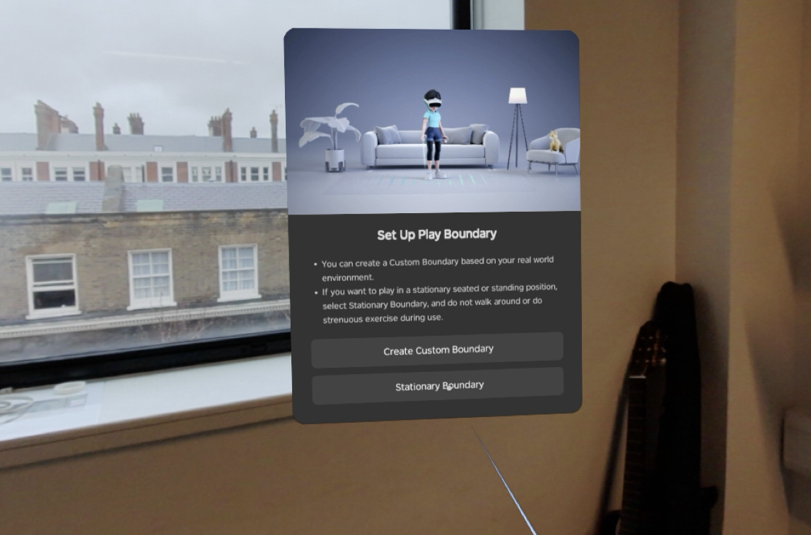
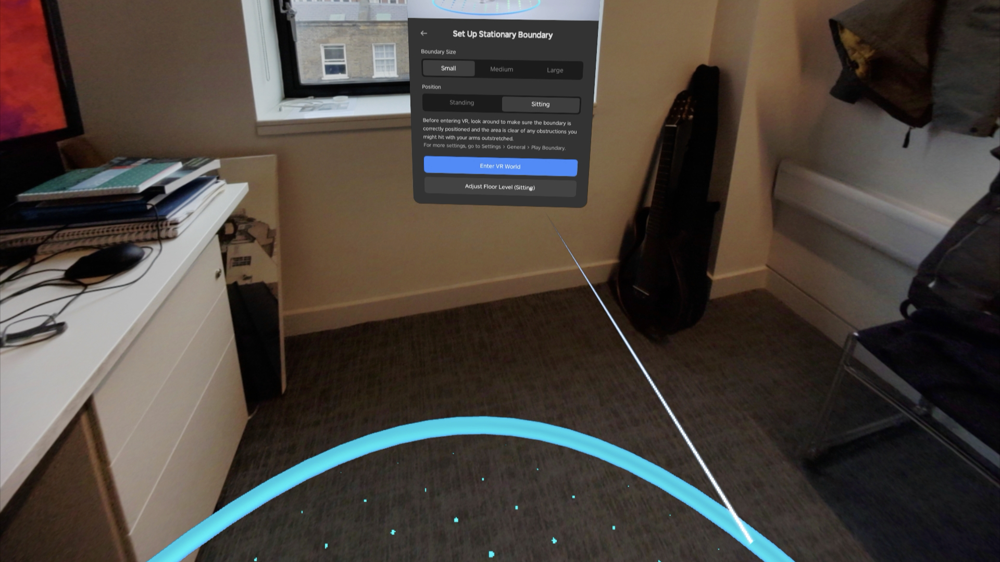
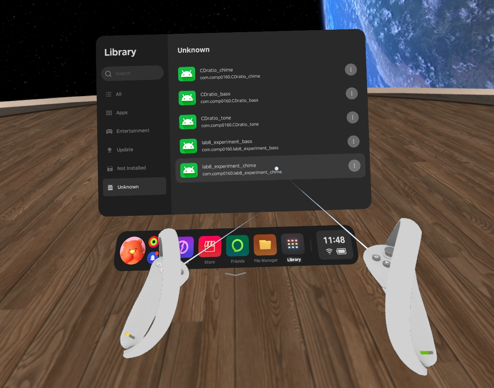
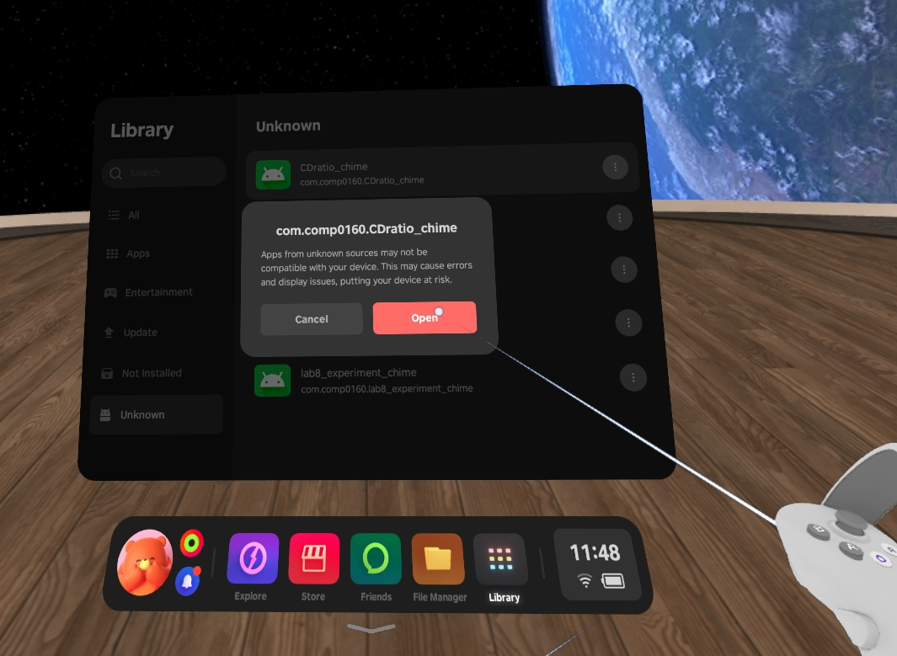
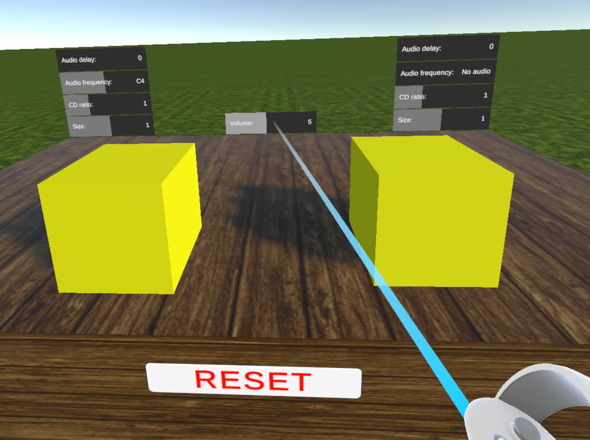
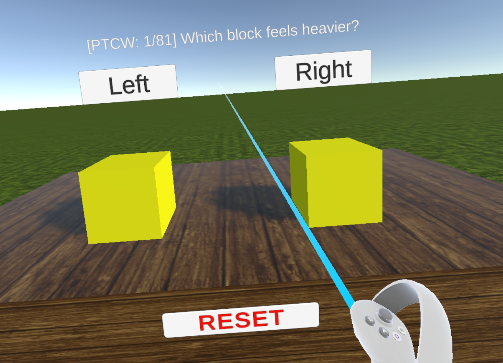

# Lab Session 8: Multisensory Processing

This week's session builds on the pseudo-haptic experiments from
weeks 6 and 7. The main addition this week is an **auditory** stimulus.
The pseudo-haptic effect is already multi-sensory, arising from the
interaction between vision and proprioception. How will the inclusion of
another sensory input affect it, if at all?

## Requirements

**Bring your laptop and headphones.** Once again, an iPad or other touchscreen
device will not do. Bring a physical mouse if you have one, or use one from
the BYOD lab.

You should have already installed an configured Unity, but if not, please
see the [week 6 briefing](lab6.html) for information.

## Background

As seen in the previous two sessions, the controller/device (C/D) ratio shapes
the subjective experience of manipulating objects in a virtual space and can
produce an illusion of "weight" in an otherwise intangible virtual object.
The effect arises from the interaction of different sensory modalities, but
vision and touch may not be the only factors. In this case we will consider
the impact of co-occurring audio stimuli.

Audio and visual information can interact in complex ways so as to enhance
either the visual or auditory experience or the combined audio-visual experience.
The extent of such an enhancement will depend on the timing difference between
the audio and visual stimulus as well as the nature of the display/interface.

As in last week's session, we wish to investigate the perceptual interactions
experimentally, with the same considerations:

* What aspects might we want to explore?
* How may the interactions be quantified?
* What would we need to measure?
* What kind of data analysis would be required?

# Screen Based Tasks

**NB: please wear headphones/earbuds for these tasks!** 

## Project Setup

Launch the **Unity Hub** application and sign into your Unity account if you have not
already done so. Create a new project for this session:

* Select the **Universal 3D** project template if it is not selected already.
* Give your project a name and optionally a location.
* We recommend unchecking the **Connect to Unity Cloud** option.

Download [lab8.unitypackage](unity/lab8.unitypackage) and put it somewhere convenient.

In Unity, select **Assets → Import Package → Custom Package...** from the
main menu. Choose `lab8.unitypackage` and click **Open**. In the resulting
import options dialog, click **Import**.

Once everything has imported, go to the **Project** browser in the bottom left corner
of the window, and select **Scenes**. Double-click on the **CD_ratios_audio** scene to
open it.

This scene is similar to the one from last week, but has some new properties:

* **Audio cues**: Each of the objects can now be associated with a sound. You can select
  among a range of included sounds, as follows:
  * Select the object in the Hierarchy panel.
  * In the Inspector panel, look at the **Audio Source** component.
  * Click on the button to the right of the AudioClip. This will bring up a pop-up
    window with a list of sounds to from (or choose None if you don’t want any sound).
  * You do not need to adjust any other elements of the Audio Source component.
    The sound for each object will play when it is selected when the game is running.
* **Acoustic delay**: The default behaviour is for the tone to play as soon as the object
  is selected, but we will also want to experiment with delaying the onset of the
  acoustic cue. You can delay the onset of the acoustic cue for each object individually,
  as follows:
  * Select **SelectionManager** in the Hierarchy panel.
  * In the Inspector panel, you will see a list of parameters for the audio delay of
    each object.
  * Type in the delay you want to add in the boxes next to each of these.
    The delay is measured in seconds.
* **Variable Volume**: By default each tone will play at a constant preset volume.
  You can change this behaviour by selecting **Variable Volume** in the Inspector Panel
  for the **SelectionManager**. This will cause volume to increase when the object is
  being lifted and decrease as it is lowered.

## Task 1: Exploration

Once again, your first task is just to play around with the parameters to
get a feel for their effects and how (if at all) they interact.

Run the scene. Use the inspector to make changes to the object masses, and
to the attached sounds, and to the delays. Lift the objects with your mouse.

* Does the sound influence the feeling of heaviness or lightness elicited
  by the mass?
* Does adding an onset delay change the effect?
* If so, how?
* Can you think of a rationale for any effects you observe?

## Task 2: Experiments

**For this task you should work in pairs or small groups.**

As last week, you should try to devise one or more experiments
to quantify some aspect(s) of the interactions between C/D ratio
and sound.

As before you should consider:

* What is your experimental paradigm?
* What are the stimuli?
* What is the response and how are you measuring it?
* What question are you asking your experimental subjects?
* Can you identify any sources of bias or confounding? Is there some way to
  mitigate them?
* Are there any ethical issues you need to take into account?
* How will you analyse the collected data, and what will it tell you?
* How might you present your results?
* Will you be able to tell if your findings are real?

You may choose to collaborate with your teammates on a single design
or devise individual experiments. Either way you should then **perform the
experiments on each other** in turn, so that everyone acts as both experimenter
and subject.

Collect and analyse your data.

* What does it tell you?
* Is it what you expected?
* Are there any changes you would make to your experimental design in retrospect?

# Headset-based tasks

As last week, please work in pairs or groups when using the Pico 4 VR headsets,
with one of you looking out for the person wearing the headset. Ensure that person
remains safe and doesn't accidentally smack into any people or objects around them.

## Setting Up

When you first put on the headset, you will be shown pass-through video of your
surroundings and invited to set up a play boundary.

Choose a **stationary boundary** and then set it to be **sitting** and **small**.
You might need to manually adjust the floor level -- the default configuration
will probably put the floor at desk level, which may mean objects in the experiments
below are out of reach. (You can always reconfigure this later if needed.)

Once you are satisfied, select **Enter VR World**.

There are five different (though similar) VR applications for this week's
session. To run them, choose **Library** from the main toolbar, and then
**Unknown** from the sidebar in the library window.

A warning will be shown when you try to run any of these applications.
Just select **Open** and run them anyway.

## Task 3: Exploration

There are three exploratory VR apps, **CDratio_tone**, **CDratio_chime** and
**CDratio_bass**, which differ only in the sounds used. They look like this:

The yellow blocks can be grasped by pushing the controller *into* them and
pressing the side trigger. You can lift and lower them by moving the controller
while grasping. The resulting visual movement depends on the C/D ratio, producing
a pseudo-haptic effect.

Adjust the parameters for each block using the sliders. Try out a range of
values and see how they feel. You can use both controllers to lift the blocks
simultaneously to compare different settings side by side.

(Note: the **reset** button on the front of the table will put everything back to
its initial state. This may be useful if, eg, you drop the blocks outside the
play area.)

Once again, consider the effect of the different parameters.

* Do you perceive the pseudo-haptic effect at all?
* Are there values for which the illusion breaks down?
* Is there an interaction between C/D ratio and size?
* Is there an interaction between C/D ratio and sound?
* Does the sound have a noticeable effect?
* Does an audio delay have a noticeable effect?

## Task 4: Experiments

We again provide applications that automate a series of experimental trials
with randomised values and gather responses. As with the week 7 experiments, the
collected data is saved to a local file on the headset, which we will download after
the lab and post to Moodle. Make sure to record the identifying 4-letter code so that
you can retrieve your data later. Please also note the number of the headset you are using.

### lab8_experiment_bass, lab8_experiment_chime

These two experiments differ only in the sounds used.
You only need to do one of them, though you are welcome to do them both if you have the
time and inclination. It may be interesting to compare whether there is any difference
between the results obtained with the two sound sets.

There are 81 trials in each experiment. For each trial, you are asked to compare two
blocks and determine which feels heavier.

One thing worth thinking about here is the extent to which knowledge of the
C/D ratio and pseudo-haptics may affect your results.

* Does the fact that you understand the illusion alter your experience of it?
* Would you expect a naïve subject to perform differently?
* Can you identify anything in the structure of this experiment that might
  bias the outcome?

