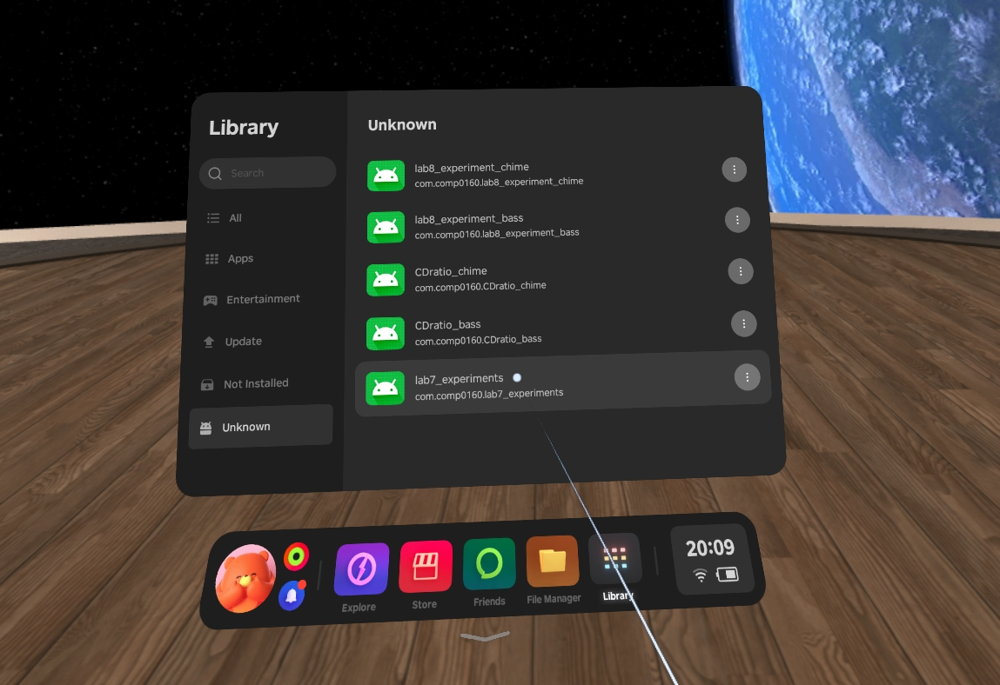

# Lab Session 8: Virtual Reality, Audio & Cognitive Load

This week's session builds on the pseudo-haptic experiments from
week 6, with some notable additions.

First of all, we'll include an **auditory** stimulus, to see how this
affects the pseudo-haptic experience. Pseudo-haptics is already multi-sensory,
arising from the interaction between vision and proprioception. How will
the inclusion of additional sensory input affect it, if at all?

Second, we will look at the same environment using a **virtual reality**
headset and motion controllers in place of a flat screen and mouse.
Will the effect carry over to this more immersive environment?

In addition, we will also consider the effect of **cognitive load** on the
pseudo-haptic experience.

**Note:** due to last week's cancellation, there's a fair bit of material
to cover this week. It will probably be tempting to skimp on the boring
"experimental design" aspects and just fool around in VR. I'd encourage
you *not* to do that. Obviously you must decide for yourselves how to
spend your time, but issues of how to investigate and measure perceptual
phenomena are central to the module and are likely to come up in the
exam.

## Requirements

**Bring your laptop and headphones.** Once again, an iPad or other touchscreen
device will not do. Bring a physical mouse if you have one.

You should have already installed an configured Unity, but if not, please
see the [week 6 briefing](lab6.html) for information.

## Background

As introduced in the previous session, the controller/device (C/D) ratio shapes
the subjective experience of manipulating objects in a virtual space. We can use this
to produce an illusion of "weight" in an otherwise intangible virtual object when
the kinaesthetic perception of the movement applied to it is greater than
what is perceived visually. The user has to *work harder* to obtain the
desired apparent movement, and the brain interprets that effort as heaviness.

However, in general we will not experience these kind of perceptual effects in
isolation and they may be modulated by other factors. In this case we will consider
the impact of co-occurring audio stimuli, and also of cognitive load.

Audio and visual information can interact in complex ways so as to enhance
either the visual or auditory experience or the combined audio-visual experience.
The extent of such an enhancement will depend on the timing difference between
the audio and visual stimulus as well as the nature of the display/interface.

Cognitive load refers to the additional memory capacity that may be required when
we have to juggle different tasks at the same time. It can be important to take this
into account in the design and evaluation of interfaces and environments that may be
used under different degrees of cognitive load.
    
<small>NB: Cognitive load can have an impact on a wide variety of perceptual processes,
not only pseudo-haptics. This is just a convenient example in the context of these
practical sessions.</small>

A simple way in which the effect of increased cognitive load on a task can be measured
is by carrying out the task whilst keeping your brain busy on another thinking task
— e.g., counting backward in 7s starting from a high number such as 679.

As in last week's session, we will be interested in investigating the
perceptual interactions experimentally, and the same set of questions need
to be considered:

* What aspects might we want to explore?
* How may the interactions be quantified?
* What would we need to measure?
* What kind of data analysis would be required?

# Screen Based Tasks

**NB: please wear headphones/earbuds for these tasks!** 

## Project Setup

Launch the **Unity Hub** application and sign into your Unity account if you have not
already done so. Create a new project for this session:

* Select the **Universal 3D** project template if it is not selected already.
* Give your project a name and optionally a location.
* We recommend unchecking the **Connect to Unity Cloud** option.

Download [lab8.zip](unity/lab8.zip) and unzip it. Locate the `lab8.unitypackage`
file inside the resulting folder.

Back in Unity, select **Assets → Import Package → Custom Package...** from the
main menu. Choose `lab8.unitypackage` and click **Open**. In the resulting
import options dialog, click **Import**.

Once everything has imported, go to the **Project** browser in the bottom left corner
of the window, and select **Scenes**. Double-click on the **CD_ratios_audio** scene to
open it.

This scene is similar to the one from lab 6, but has some new features:

* **More objects**: There are now two copies of each type of object.
  This is to allow you to compare lifting visually identical objects,
  but possibly with different physical and acoustic characteristics.
* **Clutching**: One problem with the mouse interface is that we often run out of space
  – the cursor reaches the edge of the screen and we aren’t able to lift our object any
  further. To get around this, a clutch mechanism is now introduced.
  If you hold down the **space bar** then your mouse movements will have no effect
  on the selected object, allowing you to reposition the mouse cursor so that you can
  lift the object further. (Note that releasing the mouse button will still drop
  the object even with the space bar down.)
* **Audio cues**: Each of the objects can now be associated with a sound. You can select
  among a range of included sounds, as follows:
  * Select the object in the Hierarchy panel.
  * In the Inspector panel, look at the **Audio Source** component.
  * Click on the button to the right of the AudioClip. This will bring up a pop-up
    window with a list of sounds to from (or choose None if you don’t want any sound).
  * You do not need to adjust any other elements of the Audio Source component.
    The sound for each object will play when it is selected when the game is running.
* **Acoustic delay**: The default behaviour is for the tone to play as soon as the object
  is selected, but we will also want to experiment with delaying the onset of the
  acoustic cue. You can delay the onset of the acoustic cue for each object individually,
  as follows:
  * Select **SelectionManager** in the Hierarchy panel.
  * In the Inspector panel, you will see a list of parameters for the audio delay of
    each object.
  * Type in the delay you want to add in the boxes next to each of these.
    The delay is measured in seconds.
* **Variable Volume**: By default each tone will play at a constant preset volume.
  You can change this behaviour by selecting **Variable Volume** in the Inspector Panel
  for the **SelectionManager**. This will cause volume to increase when the object is
  being lifted and decrease as it is lowered.

## Task 1: Exploration

As in week 6, your first task is just to play around with the parameters to
get a feel for the effects and how (if at all) they interact.

Run the scene. Use the inspector to make changes to the object masses, and
to the attached sounds, and to the delays. Lift the objects with your mouse.

* Does the sound influence the feeling of heaviness or lightness elicited
  by the mass?
* Does adding an onset delay change the effect?
* If so, how?
* Can you think of a rationale for any effects you observe?

Repeat this with and without cognitive load, using a backwards counting task or
any other activity you can think of that will keep your brain busy and distracted.
Does this make a difference to your perception of object weight?

## Task 2: Experiments

**For this task you should work in pairs or small groups.**

Similarly to week 6, you should try to devise one or more experiments
to quantify some aspect(s) of the interactions between C/D ratio, sound
stimuli and cognitive load.

As before you should consider:

* What is your experimental paradigm?
* What are the stimuli?
* What is the response and how are you measuring it?
* What question are you asking your experimental subjects?
* Can you identify any sources of bias or confounding? Is there some way to
  mitigate them?
* Are there any ethical issues you need to take into account?
* How will you analyse the collected data, and what will it tell you?
* How might you present your results?
* Will you be able to tell if your findings are real?

You may choose to collaborate with your teammates on a single design
or devise individual experiments. Either way you should then **perform the
experiments on each other** in turn, so that everyone acts as both experimenter
and subject.

Collect and analyse your data.

* What does it tell you?
* Is it what you expected?
* Are there any changes you would make to your experimental design in retrospect?

# Headset-based tasks

The Pico 4 VR headsets provide an immersive stereoscopic 3D environment with
spatial audio. This has practical implications in a constrained environment
like a classroom. The person using the headset may be quite isolated from their
immediate physical surroundings and deprived of many of the usual perceptual cues
that allow them to navigate those surroundings safely.

It is therefore important
that you again **work in pairs or groups**. When one of you is using the headset,
the other(s) should ensure that person remains safe and does accidentally smack into
any people or objects in the vicinity. (You will be seated for these tests, but it
is surprisingly easy to bump into things, knock your laptop to the floor, etc.)

## Setting Up

When you first put on the headset, you will be shown pass-through video of your
surroundings and invited to set up a play boundary.

Choose a **stationary boundary** and then set it to be **sitting** and **small**.
You might need to manually adjust the floor level -- the default configuration
will probably put the floor at desk level, which may mean objects in the experiments
below are out of reach. (You can always reconfigure this later if needed.)

Once you are satisfied, select **Enter VR World**.

There are five different (though similar) VR applications for this week's
session. To run them, choose **Library** from the main toolbar, and then
**Unknown** from the sidebar in the library window.

A warning will be shown when you try to run any of these applications.
Just select **Open** and run them anyway.

## Task 3: Exploration

There are two exploratory VR apps, **CDratio_chime** and **CDratio_bass**,
which differ only in the sounds used. They look like this:

The yellow blocks can be grasped by pushing the controller *into* them and
pressing the side trigger. You can lift and lower them by moving the controller
while grasping. The resulting visual movement depends on the C/D ratio, producing
a pseudo-haptic effect.

Adjust the parameters for each block using the sliders. Try out a range of
values and see how they feel. You can use both controllers to lift the blocks
simultaneously to compare different settings side by side.

(Note: the **reset** button on the front of the table will put everything back to
its initial state. This may be useful if, eg, you drop the blocks outside the
play area.)

Once again, consider the effect of the different parameters.

* Do you perceive the pseudo-haptic effect at all?
* Are there values for which the illusion breaks down?
* Is there an interaction between C/D ratio and size?
* Is there an interaction between C/D ratio and sound?
* Does the sound have a noticeable effect?
* Does an audio delay have a noticeable effect?

## Task 4: Experiments

Unlike in the screen based environment, on the VR headsets it is not really
practical for one person to adjust the settings and test them on another.
Instead, we provide three applications that automate series of trials with
randomised values and gather responses.

For all three of these apps, the collected data is saved to a file on the
headset, which we will download after the lab and post to Moodle. Each experiment
is identified by a 4-letter code, which you should make a note of in order to
retrieve your data later. Please also note the number of the headset you are using
— the 4-letter namespace is reasonably large (~450,000) but random collisions are
possible between devices.

### lab7_experiments

This app asks you to evaluate subjective "lightness" or "heaviness"
for a single block in isolation. There are two versions of the experiment,
**simple** and **complex**, which you will be asked to choose between at the start.
Each experiment has 48 trials. Do them both.

The simple version looks like this:

(Note the 4-letter prefix identifying the experiment.)

The complex version adds cognitive load with visual and auditory distractions
and a simple game element.

Shoot the red blocks before they reach you, while also answering the experimental
questions. Note that blocks may approach from behind you. If a block reaches you,
you will lose a life. If you lose all lives before completing the experiment,
all the data is lost and you'll need to start from scratch!

Subjectively, do you notice any difference in the feeling of the blocks between the
simple and complex modes? When you retrieve your data, is there any identifiable
difference in the results?

### lab8_experiment_bass, lab8_experiment_chime

These two experiments differ only in the sounds used.
You only need to do one of them, though you are welcome to do them both if you have the
time and inclination. It may be interesting to compare whether there is any difference
between the results obtained with the two sound sets.

There are 81 trials in each experiment. For each trial, you are asked to compare two
blocks and determine which feels heavier.

One thing worth thinking about here is the extent to which knowledge of the
C/D ratio and pseudo-haptics may affect your results.

* Does the fact that you understand the illusion alter your experience of it?
* Would you expect a naïve subject to perform differently?
* Can you identify anything in the structure of this experiment that might
  bias the outcome?

